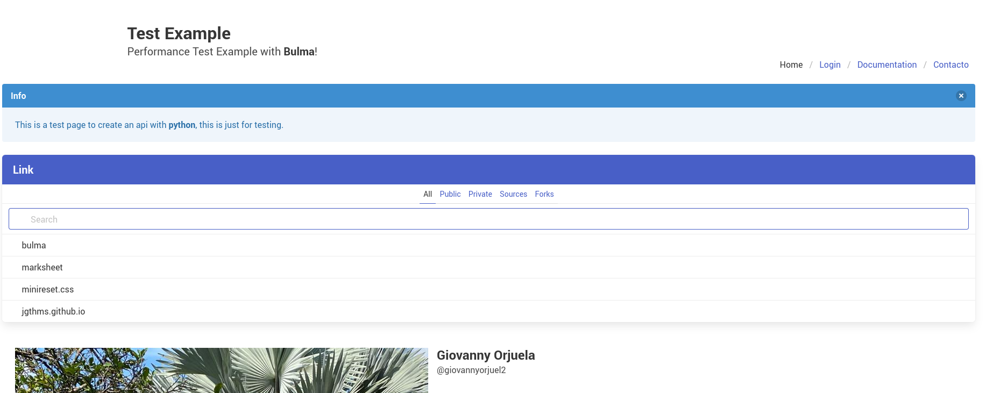

# flask-api
Flask example 

[](https://nodesource.com/products/nsolid)

[](https://travis-ci.org/joemccann/dillinger)

powered HTML5 Markdown editor.

- ✨Magic ✨

## Docker

Is very easy to install and deploy in a Docker container.

By default, the Docker will expose port 5000, so change this within the
Dockerfile if necessary. When ready, simply use the Dockerfile to
build the image.

```sh
cd flask-api
docker-compose  build --no-cache .
```

```sh
# docker-compose up -d
Creating network "flask-api_default" with the default driver
Creating flask-example ... done
```

> Note: `--capt-add=SYS-ADMIN` is required for PDF rendering.

Verify the deployment by navigating to your server address in
your preferred browser.

```sh
http://localhost:5000/
```

### home 


### login
user: admin
password: 123


## License

MIT

**Free Software, Hell Yeah!**
